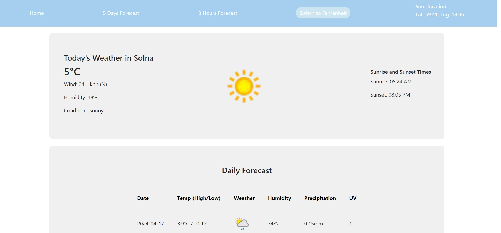
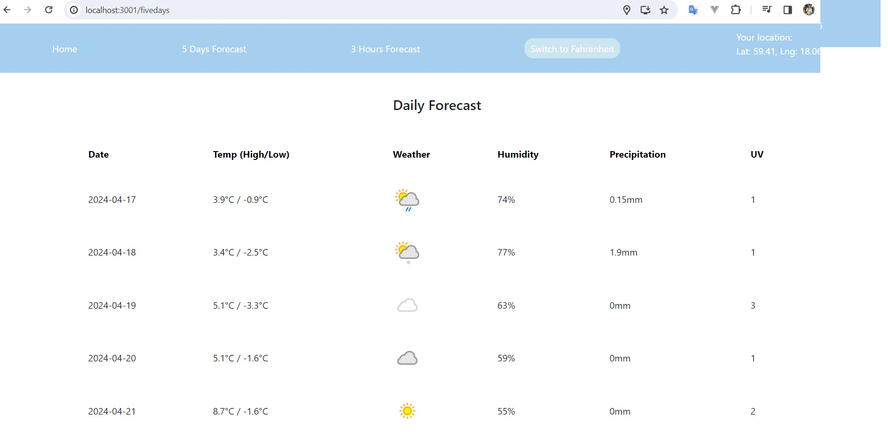
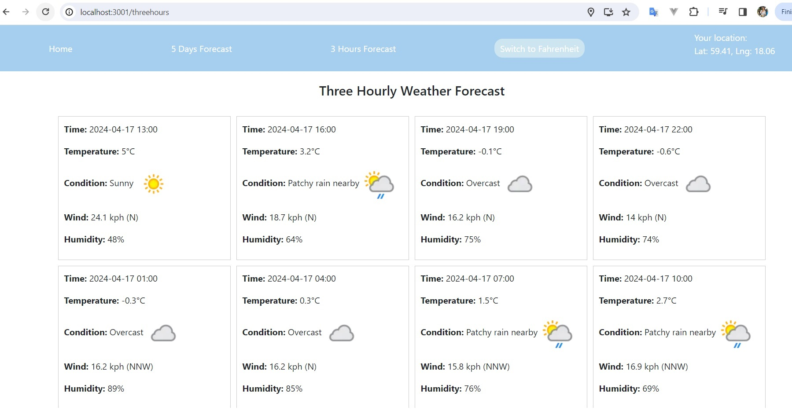
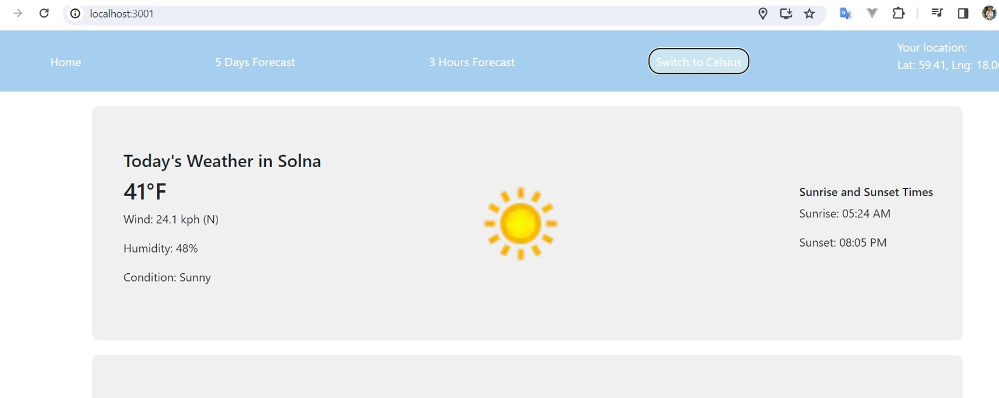

# Technical Project Description for tastetime APP

> App Link
[frontend in netlify](https://cheerful-pasca-6e4742.netlify.app/) & 

## Executive Summary
### Description of the Application
> The weather application is a web-based task management tool designed to show users about location and weatherforcast information. Built using Reactfor frontend and [weatherapi](https://www.weatherapi.com/) for weather API. 

## Operating Environment
### Technical Architecture
> The weather application follows a client-server architecture. The web interface is implemented using React for structure, bootstrap for styling, javascript for programming . The web interface is designed to be responsive and user-friendly, especially supporting for users who wants to check weatherforcast in computer browser.

## Modules
### Functional Overview
> The application comprises several key modules, each serving a specific purpose for users. These modules include Home, 5 days weather forcast, 3 hours weather forcast and switch to F/C. Users can check the weatherforcast in their location.

### Detailed Module Description
#### Home
> Users can see brief weather forecast from Homepage. And the temperature can be changed between Celsius and Fahrenheit.

#### 5 days weather forcast
> Users can see the recomendations on this page.

####  3 hours weather forcast
> Users can click the link on Recipe page and Recomendations page. Users can see the details on this page.

#### switch to F/C

## How to download and build locally
### Getting Started with Create React App

This project was bootstrapped with [Create React App](https://github.com/facebook/create-react-app).

### In the project directory, you can run:

### `npm start`

Runs the app in the development mode.\
Open [http://localhost:3000](http://localhost:3000) to view it in your browser.

### Learn More

You can learn more in the [Create React App documentation](https://facebook.github.io/create-react-app/docs/getting-started).

To learn React, check out the [React documentation](https://reactjs.org/).

###  Modify environments information
> If you want to change the APIKey, modify it  in U07-weatherapp\weather-app-js\weather-app-homework\src\api\WeatherApi.jsx

## Version Information
> Draft version 15th Apr,2024  
> Update the Navigation bar 17th Apr,2024  
> Final version 27th Apr,2024

